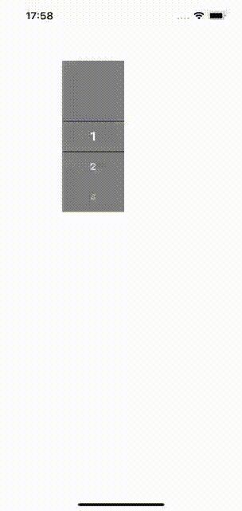

### 纯 RN 实现的滚轮选择组件

### 使用示例
```
const App = () => {

    const [value, setNum] = useState(0);

    return(
        <WheelPicker
            data={[1,2,3,4,5,6,7,8,9,10,11,12,13,14,15,1,2,3,4,5,6,7,8,9,10,11,12,13,14,15]}
            initIndex={value}
            onChange={(num)=>{
                setNum(num);
            }}
        />

    )
}
```

### 效果展示

### 属性说明

| 属性             | 类型   | 默认值 | 备注     |     |     |     |     |
|----------------|------|-----|--------|-----|-----|-----|-----|
| data           | 数组   | []  |        |     |     |     |     |
| ItemHeight     | 数字   | 50  |        |     |     |     |     |
| VisibleNum     | 数字   | 2   | 最大5    |     |     |     |     |
| Width          | 数字   | 100 | 组件宽度   |     |     |     |     |
| containerStyle | 样式   |     | 整个组件样式 |     |     |     |     |
| itemStyle      | 样式   |     | 列表项样式  |     |     |     |     |
| itemTextStyle  | 样式   |     | 文字样式   |     |     |     |     |
| indicatorStyle | 样式   |     | 指示器样式  |     |     |     |     |
| initIndex      | 默认选择 |     |        |     |     |     |     |
| onChange       | 切换事件 |     |        |     |     |     |     |

